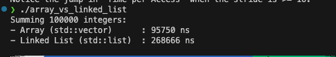
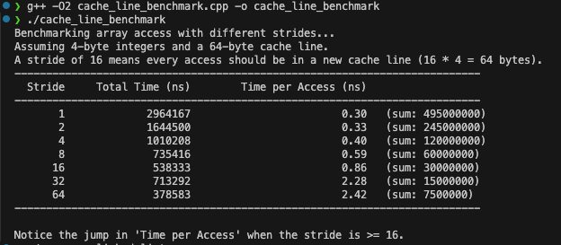

# Array vs. Linked List: A Performance Benchmark

This directory contains a simple C++ program that benchmarks the traversal speed of an array (`std::vector`) versus a linked list (`std::list`).

## The Big O Paradox

Theoretically, traversing both an array and a linked list is an **O(n)** operation. This means the time required grows linearly with the number of elements, *n*. However, when you run the benchmark, you'll notice that summing the elements of an array is significantly faster (often 2-3x or more) than summing the elements of a linked list.

## Why Are Arrays Faster?

The performance difference is not due to algorithmic complexity but to modern CPU architecture, specifically **caching** and **spatial locality**.

### 1. Spatial Locality and Cache-Friendliness (Arrays)

- **Contiguous Memory:** An array (or `std::vector` in C++) stores its elements in a single, contiguous block of memory. `array[0]`, `array[1]`, `array[2]`, and so on, are all right next to each other.
- **CPU Caching:** When the CPU needs to read data from memory, it doesn't just fetch a single byte. It fetches an entire **cache line** (typically 64 bytes). When you access `array[0]`, the CPU fetches the cache line containing `array[0]` through `array[15]` (assuming 4-byte integers).

- **High Cache Hit Rate:** Because the next 15 elements you're likely to access are already in the ultra-fast CPU cache, those subsequent memory accesses are nearly instantaneous. This results in a very high cache hit rate, minimizing slow trips to main memory (RAM).

### 2. Pointer Chasing and Cache Misses (Linked Lists)

- **Scattered Memory:** A linked list's nodes are allocated dynamically. Each `new Node()` call can place the node anywhere in memory. The nodes are not stored next to each other; they are connected by pointers.
- **Pointer Chasing:** To traverse the list, the CPU must read the address of the next node (a pointer) and then jump to that memory location. These locations are often far apart and unpredictable.
- **High Cache Miss Rate:** When the CPU accesses a node, it fetches the corresponding cache line. However, the *next* node is very unlikely to be in that same cache line. This forces the CPU to go back to main memory to fetch the next node's data, resulting in a **cache miss**. These frequent cache misses are the primary cause of the poor traversal performance.

## Conclusion

This benchmark demonstrates a critical concept in performance engineering: **Big O notation describes algorithmic complexity but ignores the massive impact of hardware architecture.**

An algorithm that is "cache-friendly" by design will almost always outperform a cache-unfriendly one in the real world, even if they have the same theoretical time complexity. The spatial locality of arrays makes them a superior choice for sequential access patterns.
